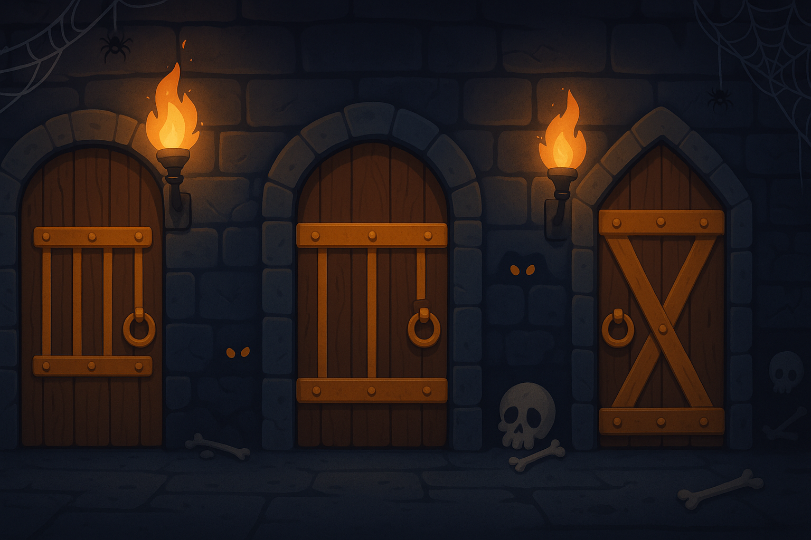

   
    
   
  
  

    
    
    
  

<h1 align="center">Dungeon Doors Game</h3> 

## 🤸 Demo

Git it a go [here](https://dungeon-doors.vercel.app/) :)

## 🤖 About

A simple, fun game where you guess the right doors to find treasures while avoiding monsters.  
Originally built to play with my son on an iPad, it includes a service worker so it can be installed and played like a native app.

## 🚨 Rules

- The game is played by **2 players**, taking turns one after another.
- On each turn, a player chooses **one of three doors**.
- Behind each door, there may be either:
  - **treasure** (worth 25 or 50 points)
  - **monster**.
- The first player to reach **1000 points** wins.
- A player continues choosing doors until they encounter a **monster**.
  - If a monster is found, the turn immediately passes to the other player.
- At the start, there are always **2 treasures and 1 monster** behind the doors.
- As players score more points, the difficulty increases: the chance of facing **2 monsters and only 1 treasure** becomes higher.

## ⚙️ Limitations

- The game was originally designed for specific screen resolutions and is **not yet fully responsive**.
- The menu is **minimalistic**, reflecting the fast-paced nature of the game’s initial development.
